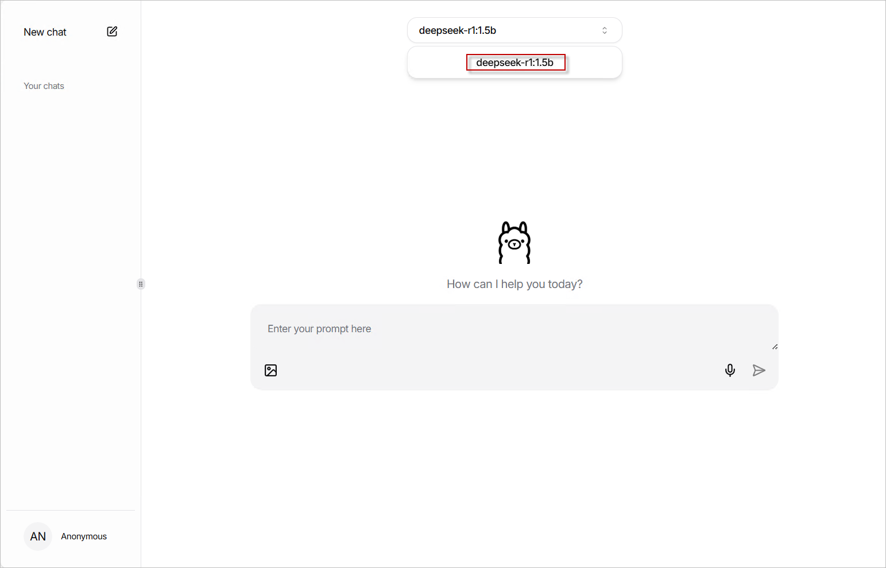
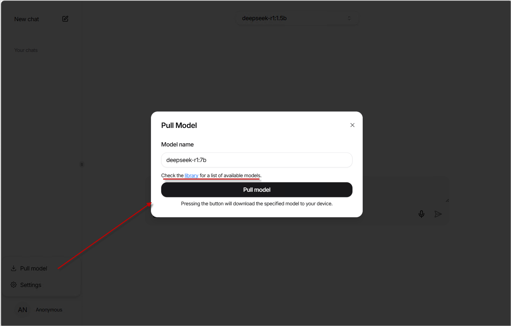

# Chat with Deepseek

Buildin with DeepSeek R1 1.5b and WebUI.

## Quick start with Docker

```bash
# with CPU
docker run -d -p 8080:3000 -p 11434:11434 --name chat-ds --restart always ghcr.io/zeed-w-beez/chat-with-deepseek:latest

# with GPU
docker run -d -p 8080:3000 -p 11434:11434 --gpus all --name chat-ds --restart always ghcr.io/zeed-w-beez/chat-with-deepseek:latest
```

## Chat with buildin `deepseek-r1:1.5b` model



## Chat with other models

The built-in WebUI of this template uses the open-source project <https://github.com/jakobhoeg/nextjs-ollama-llm-ui>, which supports downloading other models online. 

Click the pull model button at the bottom left and enter the correct model name to download and use it.



## Ollama Restful API also Supported

You can also directly call the API. Examples are as follows:

> For more information about Ollama Restful API interfaces and parameters, please refer to the [Ollama API documentation](https://github.com/ollama/ollama/blob/main/docs/api.md)

```http
### view available models
GET http://localhost:11434/api/tags HTTP/1.1
Content-Type: application/json

### generate text
POST http://localhost:11434/api/generate HTTP/1.1
Content-Type: application/json

{
    "model":"deepseek-r1:1.5b",
    "prompt":"why is the sky bule?",
    "stream": false
}
```
